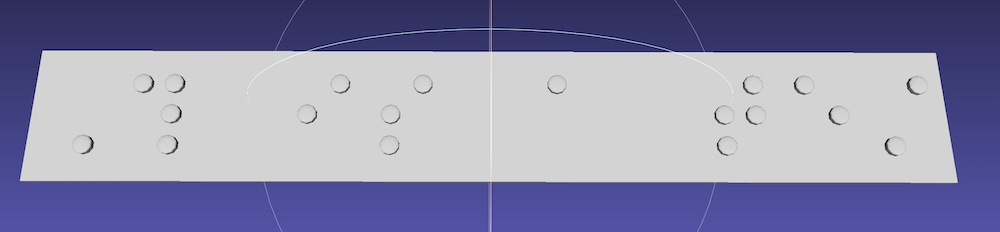

# Braille3D

A set of Python scripts to translate English into Braille, and generate 3D-printable models of the output.

By default, the output from the system assumes *Specification 800* of the [National Library Service for the Blind and Print Disabled of the Library of Congress](https://www.loc.gov/nls/). This is very straightforward to change in the `braille.py` script.


### Prerequisites:

- Python 3
- The [`Liblouis`](http://liblouis.org/) Python bindings for standard operation module (via e.g., `pip3 install pylouis` or by building from source). The `dumb` operation mode does not require `liblouis`, but should only be used in emergencies!

### Usage

```
$ python3 braille.py
Usage: python3 braille.py "text to convert" [dumb]
Output: a Wavefront .obj file of the converted text.
If optional "dumb" parameter is specified, uses dumb internal translator. WARNING: Only for emergencies!
```

Please note the warning carefully; the use of the internal translator is *strongly* discouraged. This functionality is highly incomplete and is for emergency use only. However, this aspect of the system may be expanded in future to provide better translation without requiring external dependencies. At this point, the default processing mode (which calls into the [Liblouis](http://liblouis.org/) library) should be used.

### Example

To generate a 3D model of the text `This is a test` in [Wavefront .obj](https://en.wikipedia.org/wiki/Wavefront_.obj_file) format:

```
$ python3 python3 braille.py "This is a test" > test.obj
```

The first line of the output file describes the conversion the script performed:

```
$ head -n5 test.obj
# input => Braille => back translation : "This is a test" => "⠠⠹⠀⠊⠎⠀⠁⠀⠞⠑⠌" => "This is a test"
v 4.270 2.660 0.000
v 4.270 3.380 0.000
v 4.693 3.242 0.000
v 4.955 2.882 0.000
```

As visualised in [MeshLab](https://www.meshlab.net), the output file looks like this:


